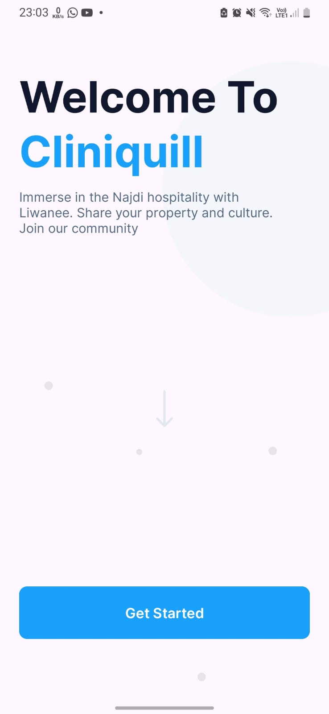
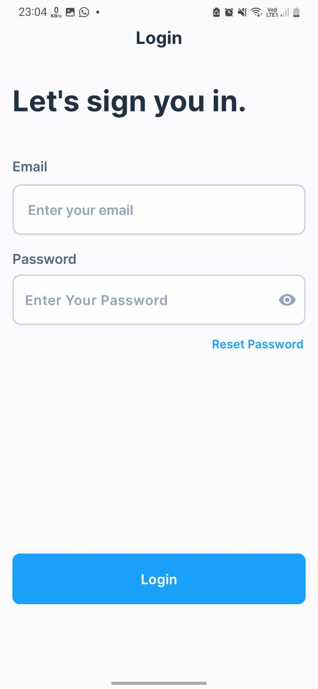
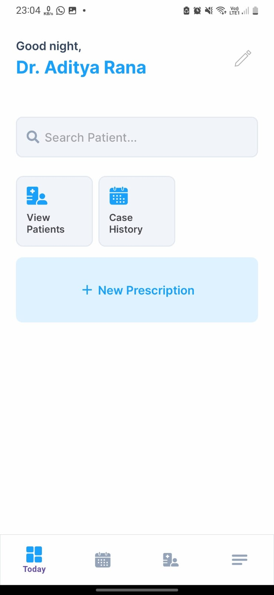
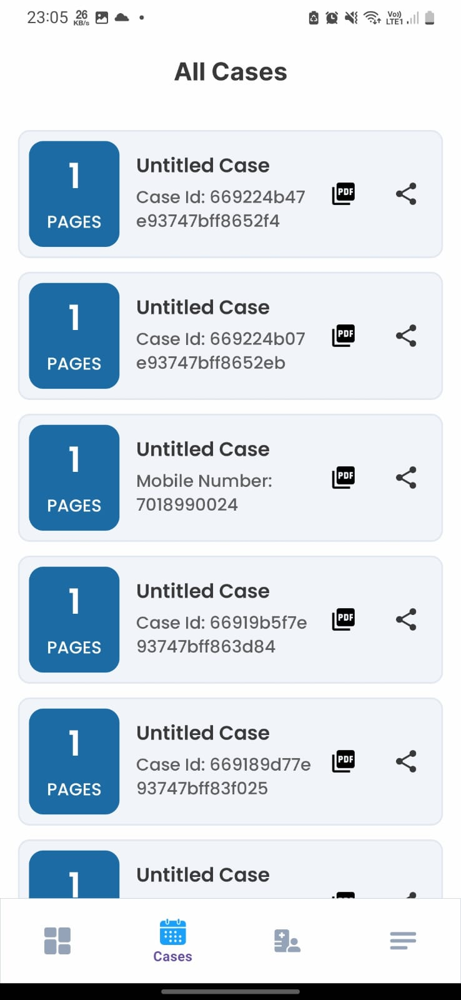
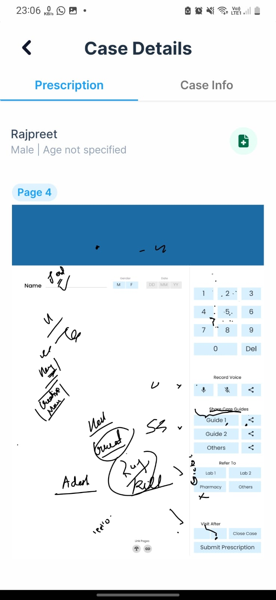
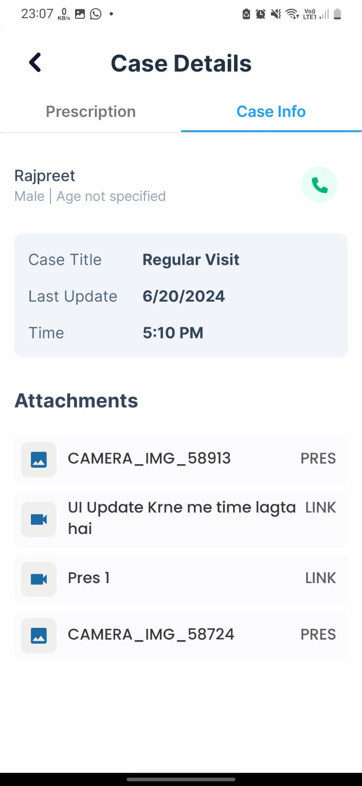
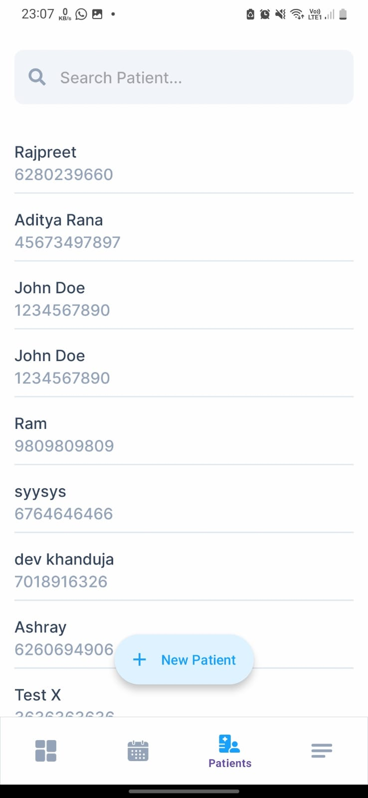
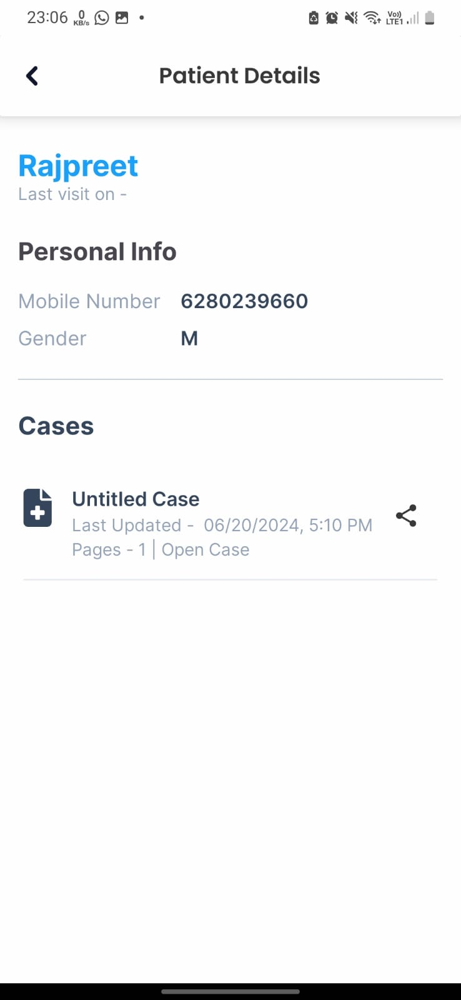
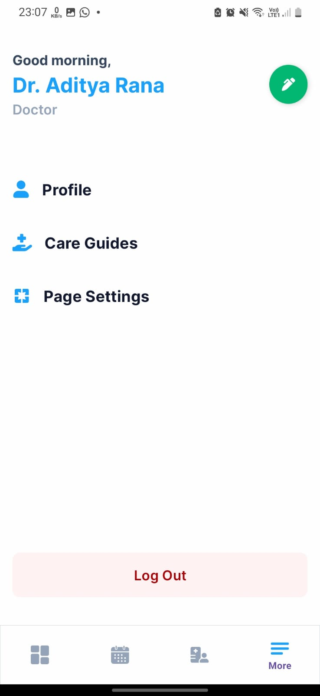

# Smart Pen and Encoded Paper Digitization Project

## Problem Statement

Medical professionals often rely heavily on handwritten notes and forms. This traditional method of data recording can be inefficient, error-prone, and difficult to integrate with modern digital systems. There is a need for a seamless solution that allows doctors to digitize their handwriting in real-time, reducing administrative workload and improving data accuracy.

## Solution

This project provides a robust solution to digitize handwritten notes and forms using an IR-enabled pen and binary encoded paper. The system captures handwriting in real-time, processes it, and integrates it into a digital format that can be easily accessed and managed. The solution includes features such as image caching, real-time data processing, and a comprehensive backend system to handle and store data efficiently.

## Features

- **Real-time Digitization**: Converts handwritten notes into digital format in real-time.
- **Attachments** : Attachments of doctor's voice, image or video's can be added to the case and shared to patients. (Multipart uploads are supported)
- **Image Caching**: Efficient caching mechanism to handle image data and improve performance and speed.
- **Backend Integration**: Node.js and Express server, Redis for caching, BullMQ for request queues and AWS S3 for storage.
- **Bluetooth Connectivity**: Maintains a connection with the pen to receive signals.
- **Layout Configuration**: Dynamic layout configurations for different users stored on the server.
- **Multiple Activity Integration**: Seamlessly integrates with multiple activities in the Android app.
- **Configurable Symbols**: Symbols can be defined as buttons or input fields with relative or absolute positions.

## Technology Stack

- **Frontend**: Android (Java)
- **Backend**: Node.js, Express.js
- **Database**: MongoDB, Redis
- **Storage**: AWS S3
- **Communication**: Bluetooth
- **Caching and Message Broking**: Redis
- **Deployment**: AWS
- **Libraries**: Gson, Volley, Picasso

## Screenshots

 |  | 
 |  | 
 | 
 | |

## Repository Links

- [Backend Repository](https://github.com/AdityaRajputRana/MedicalAppBackend)
- [Android App Repository](https://github.com/AdityaRajputRana/Medical-App-Admin)